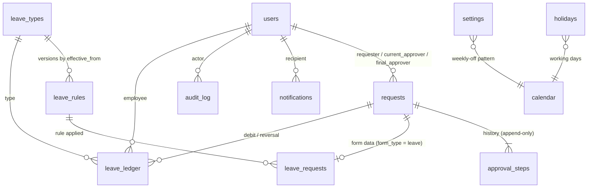

# ARCHITECTURE — Office App

The rules, data model and operations are specified in `docs/superpowers/specs/2026-09-25-office-app-leave-design.md`
(the "design"). This file is how the code is shaped so stories can run in parallel.

## Platforms and frameworks
| Target | Framework | Why (and the tradeoff accepted) |
|---|---|---|
| Web (phone + laptop browsers) | Go 1.27.1 + PocketBase v0.40.4 as a library | One language, one binary; auth, SQLite, files, cron, backups built in. Tradeoff: PocketBase is pre-1.0 → pinned, upgrades rehearsed (design §9) |
| UI | Go `html/template` + htmx 2.0.11 + Pico.css 2.1.1 (vendored, checksums in `internal/core/web/static/VERSIONS`) | No JS build, strict CSP. Tradeoff: no rich client widgets (none needed) |

Toolchain: `go.mod` says `go 1.27` / `toolchain go1.27.1`; an older local Go downloads 1.27.1 automatically.

## Shape: modular monolith
```
cmd/officeapp/main.go          pocketbase.New() → modules.Register → Start
internal/modules/modules.go    the ONE module list (edited only when a whole new module/form is added)
internal/core/<module>/        shared platform modules
internal/forms/<form>/         one folder per form (leave first)
internal/testapp/              test app: every module registered, demo data seeded once and cloned
```
Inside a module: **handlers (routes + templates) → service (rules, transactions) → data (collections via PocketBase)**.
Handlers never write records directly; they call the module's service. Services take `txApp core.App`
inside `RunInTransaction` and read only through it (design §4, §7).

Between modules: only through a module's **root package** (`officeapp/internal/core/approvals`, not its
subpackages). A module may put internals in `<module>/internal/...`; Go forbids anyone else importing them.
`scripts/check-imports.sh` (in `make check`) also enforces: core never imports a form; forms never import
each other; only `cmd/` and `internal/testapp` import `internal/modules`.

**Registration without shared files:**
- A module's root file has `Register(app)` that runs `parts`; each feature file adds itself with
  `func init() { addPart(func(app core.App) { ... }) }` — routes via `app.OnServe().BindFunc`, hooks,
  `seed.Add(app, name, fn)`, `home.AddCard(app, card)`. No story edits `Register` or `modules.go`.
- **Migrations** are Go files named `<unix-timestamp>_<what>.go` inside the owning module, registered with
  `m.Register(up, nil)` in `init()`. PocketBase sorts all migrations by file name, so a story picks the
  current Unix time for its file name; no sequence file exists.
- **Templates** live in `<module>/templates/*.html`, embedded by that module and parsed with the shared
  layout by `web.NewPages`. A page defines `title` and `content`. Partials for htmx swaps are separate files.
- **Seed data** (`officeapp seed`): each module adds a seeder; `seed.Run` refuses a DB that already has users.

Separate processes: none. Scheduled jobs run inside the binary (PocketBase cron, design §5.5).

## Data model

Core tier actions touch: users (1), leave_ledger + leave_types + requests (2), leave_types/rules/requests +
holidays/settings + requests/approval_steps (3), requests/approval_steps/leave_ledger (4), approval_steps (5).
Fields and constraints: design §5.

## Buy vs build
| Concern | Choice | Why |
|---|---|---|
| Auth | PocketBase auth records + our cookie (`internal/core/auth`) | Password hashing, tokens, `RefreshTokenKey` built in; cookie glue ~100 lines (design §8) |
| Payments | none | — |
| Email | none in Phase 1 (Microsoft 365 SMTP later via PocketBase mailer) | Owner's decision |
| Storage | PocketBase SQLite + protected file fields in `pb_data` | Single machine; backups include files |
| Analytics | none; CSV reports (Launch) | In-house tool |

## Hosting and deploy
- Production: office Ubuntu machine, systemd, `127.0.0.1:8090`, cloudflared (public) + `tailscale serve` (admin). Deploy script with snapshot and automatic rollback — Launch tier (design §11).
- Preview per story: `scripts/preview.sh` builds the worktree, seeds demo data into `.preview/<branch>/`, serves on a free `127.0.0.1` port and prints the URL (`--stop` to stop). Demo logins E001–E004, password `demo-pass-2026`.
- Dev: `make run` (seeds `./pb_data` once, serves on :8090).
- CI: `.github/workflows/check.yml` runs `make check` on every push (active once a GitHub remote exists).

## Modules and seams for parallel work
| Module | Folder | Tier | Interface it exposes | Typical story |
|---|---|---|---|---|
| web | internal/core/web | skeleton | `NewPages`, `View`, layout, static, CSP + CSRF middleware | a shared partial or style |
| auth | internal/core/auth | Core/Usable | `RequireUser`, `Login`, `CookieName`, demo users | forced password change, HR reset |
| clock | internal/core/clock | skeleton | `Clock`, `System`, `Fixed`, `IST`, `Today` | — |
| seed | internal/core/seed | skeleton | `Add`, `Run` | — |
| home | internal/core/home | Core | `AddCard` | — |
| calendar | internal/core/calendar | Core | holidays + weekly-off pattern; is-working-day query | holidays collection, day query, HR holiday screen |
| approvals | internal/core/approvals | Core/Usable | request statuses, transition table, service actions, form hooks interface (design §4) | contract, service action, inbox page, request page, cancel flows |
| leave | internal/forms/leave | Core/Usable | form hooks implementation; balance query for home | collections contract, day count, each policy check, ledger, apply page, balance card, jobs |
| notify, audit | internal/core/notify, internal/core/audit | Usable | `Notify`, `Record` | created by their first story (adds one line to modules.go — sliced alone) |

Hotspots found by `scripts/ready.sh` and how they were removed:
- (pre-emptive) `modules.go` and each module's `Register`: Core modules pre-registered; per-file `addPart` self-registration.
- (pre-emptive) migration sequence: timestamp-named files per module.

## Budgets (from the spec)
- Pages render server-side in < 300 ms on the office machine for 250 users; no page needs JS to show data.
- Works at 390 px width without horizontal scroll.
- Personal data: no PocketBase REST API access (all collection rules `nil`); medical files only via authorised handler.
- Tests: `make check` under ~2 minutes; tests use `testapp.New` (seeded template clone), not fresh seeding.

## Anti-patterns for this codebase
- Editing `modules.go` or a module's `Register` to add a feature — use `addPart` in the feature file's `init()`.
- Reading with the outer `app` inside `RunInTransaction` — always `txApp`.
- PocketBase `date` fields for calendar dates — use text `YYYY-MM-DD` (design §5).
- Setting collection API rules to anything but `nil`, or calling the PocketBase REST API from the browser.
- `time.Now()` in business logic — take a `clock.Clock`.
- Inline `<script>`/`style=` or `hx-on` attributes — CSP forbids them; put behaviour in server responses and CSS in `app.css`.
- GET for anything that changes data. Forms post with `Sec-Fetch-Site` from the browser; tests use `testapp.FormHeaders`.
- Updating or deleting approval steps, ledger entries or audit rows — append a correcting entry.
- Adding a library for something a 20-line tested function does (design §3).
